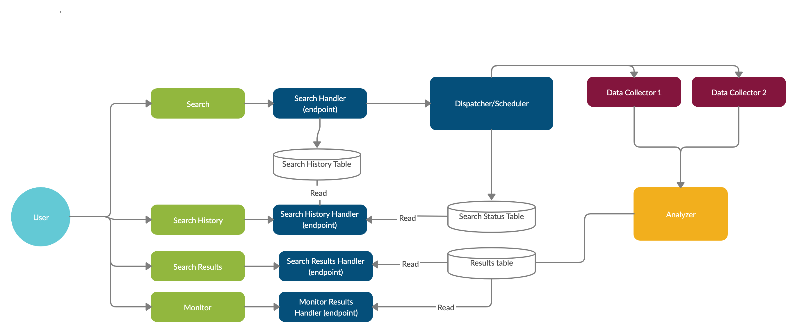

# Pipeline

# Installation
Run the following commands
1. `git clone https://github.com/kev3522/sentimentmonitor.git`

2. `virtualenv venv` (Make sure you run this in the first directory, the one that contains venv)

3. `source venv/bin/activate`

4. `pip install -r requirements.txt`

# Running the server
`python manage.py runserver`

# Creating a local server using postgresql

1. Make sure you have postgres installed on your computer, and that you can use psql (you can
  check this by running `psql --version` in your terminal). Also, make sure you have psycopg2 on Mac with through the binary package with the command `pip install psycopg2-binary`

2. Run `psql postgres` to get into the default database.

3. Once you're in psql, you can input `\du` to show all the users that you have in postgres, and
`\list` to show all the databases you own.

4. Create a database with `CREATE DATABASE [database name];`

5. ctrl-D to exit out of the current database, then run `psql [database name]` to connect to your new db.
   Then, run `\conninfo` to get your connection info.

6. Go into settings.py in the Django project and replace

`DATABASES = {
‘default’: {
‘ENGINE’: ‘django.db.backends.sqlite3’,
‘NAME’: os.path.join(BASE_DIR, ‘db.sqlite3’),
}
}`

with

`DATABASES = {
‘default’: {
‘ENGINE’: ‘django.db.backends.postgresql_psycopg2’,
‘NAME’: ‘name of your db is’,
‘USER’: ‘whatever name user created your db’,
‘PASSWORD’: '',
‘HOST’: ‘localhost’,
‘PORT’: ‘whatever port your postgres is on’,
}
}
`

# Adding/removing dependencies
Make sure to run `pip freeze > requirements.txt` from root directory if
you `pip install` or `pip uninstall` anything.
